# NeuroBin: AI-Powered Smart Waste Segregation System

NeuroBin is a smart waste classification and segregation system that integrates deep learning and embedded automation to solve the challenge of real-time waste disposal. The system classifies waste as Biodegradable or Non-Biodegradable and triggers a physical mechanism to open the appropriate bin.

## Project Overview

NeuroBin is an AI-powered waste segregation system designed to automate the classification of waste at the point of disposal. It uses a Convolutional Neural Network (CNN) to identify whether an item is Biodegradable or Non-Biodegradable based on its visual characteristics. This classification then triggers a corresponding physical response — the automatic opening of the appropriate dustbin lid.

The primary objective is to reduce improper waste disposal and promote recycling and sustainability through intelligent decision-making at the bin level. The solution is scalable and can be integrated into smart homes, schools, institutions, and city-wide smart bins. 

This project demonstrates how the integration of machine learning with real-world embedded systems can create practical and impactful environmental solutions. The complete solution involves:
- A custom-trained CNN using more than 250,000 waste images
- Fine-tuning using structured and curated datasets
- Real-time inference via camera feed and image classification
- Integration with servo-controlled physical bins

##  Circuit Diagram


## Real-World Demonstration

- Apple → Biodegradable → Biodegradable(B) bin opens  
- Cardboard → Biodegradable → Biodegradable(B) bin opens  
- Amul Lassi Tetra Pack → Non-Biodegradable(N) → Red bin opens

Video and image proof of the live system operation are provided in the `assets/` folder.

- Video Demo: `assets/Demo_video.mp4`
- Smart Bin Image: `assets/neurobin.jpg`

## Datasets Used

1. [rayhanzamzamy/non-and-biodegradable-waste-dataset](https://www.kaggle.com/datasets/rayhanzamzamy/non-and-biodegradable-waste-dataset)  
   Used for initial model training (~256,000 images).

2. [sujaykapadnis/cnn-waste-classification-image-dataset](https://www.kaggle.com/datasets/sujaykapadnis/cnn-waste-classification-image-dataset)  
   Used for fine-tuning to increase model performance.

3. [techsash/waste-classification-data](https://www.kaggle.com/datasets/techsash/waste-classification-data)  
   Used as an independent evaluation/test dataset.

## Model Architecture

The classification model is a custom-built Convolutional Neural Network (CNN) comprising:
- Three convolutional layers with max pooling
- A flattening layer followed by a dense hidden layer
- Dropout regularization for generalization
- Output layer with softmax activation for binary classification

The final model is exported in `.keras` and `.tflite` formats, making it compatible with both software testing and real-time embedded deployment.

## Files Included

| File                          | Description                                                    |
|-------------------------------|----------------------------------------------------------------|
| `model_pretrain.py`           | Initial training using the 256k image dataset                  |
| `model_training.py`           | Fine-tuning using two smaller, curated datasets                |
| `model_evaluation.py`         | Testing and confusion matrix generation                        |
| `model_inference_demo.py`     | Real-time inference via Colab-based upload                     |
| `fine_tuned_waste_classifier_v2.keras` | Final model (can be downloaded or loaded)                 |
| `requirements.txt`            | Dependency list                                                |
| `README.md`                   | Project documentation                                          |
| `assets/`                     | Images and videos of the smart bin implementation              |

## How to Run

1. Clone this repository:
```bash
git clone https://github.com/utkarshgupta-ai/NeuroBin-Smart-Waste-Segregator.git
cd NeuroBin-Smart-Waste-Segregator
```

2. Install the required packages:
```bash
pip install -r requirements.txt
```

3. Run training or demo scripts as needed:
```bash
python model_pretrain.py         # Train from scratch
python model_training.py         # Fine-tune pretrained model
python model_evaluation.py       # Evaluate model performance
```

For real-time testing:
- Open `model_inference_demo.py` in Google Colab
- Upload any waste image
- View predictions and classification confidence

## 🧪 Model Testing & Results

The NeuroBin model was tested on real-world waste items including food, packaging, and mixed materials.

<table>
<tr>
<th>Image</th>
<th>Prediction</th>
<th>Confidence</th>
</tr>

<tr>
<td>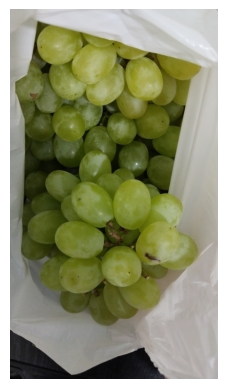</td>
<td>Biodegradable</td>
<td>100%</td>
</tr>

<tr>
<td>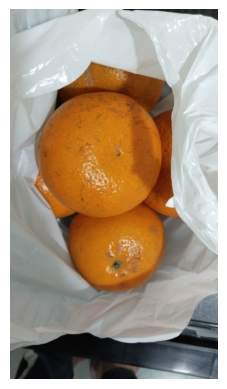</td>
<td>Biodegradable</td>
<td>99.98%</td>
</tr>

<tr>
<td>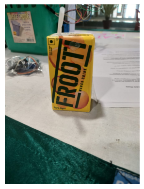</td>
<td>Non-Biodegradable</td>
<td>68.78%</td>
</tr>

<tr>
<td>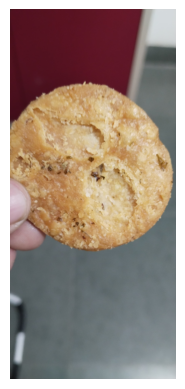</td>
<td>Biodegradable</td>
<td>100%</td>
</tr>

<tr>
<td>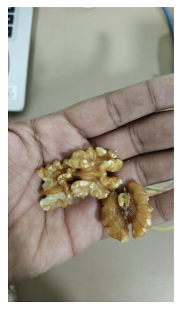</td>
<td>Biodegradable</td>
<td>73.21%</td>
</tr>

<tr>
<td>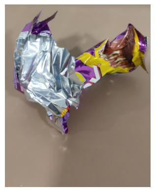</td>
<td>Non-Biodegradable</td>
<td>87.97%</td>
</tr>

<tr>
<td>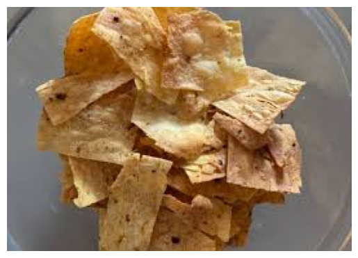</td>
<td>Biodegradable</td>
<td>100%</td>
</tr>

<tr>
<td>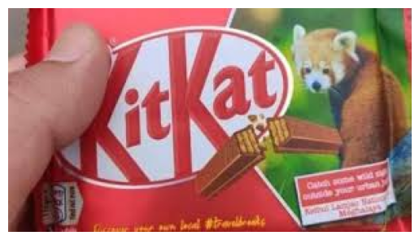</td>
<td>Non-Biodegradable</td>
<td>87.97%</td>
</tr>

<tr>
<td>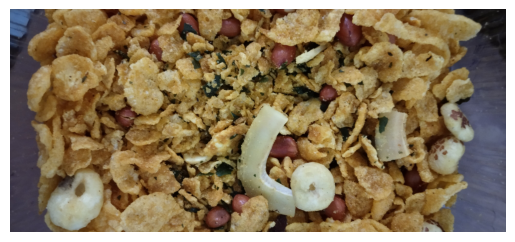</td>
<td>Biodegradable</td>
<td>100%</td>
</tr>

<tr>
<td>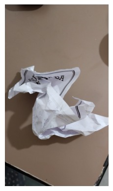</td>
<td>Non-Biodegradable</td>
<td>99.98%</td>
</tr>

<tr>
<td>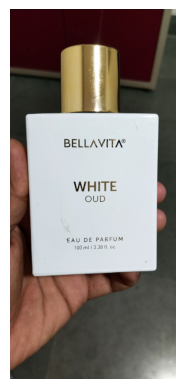</td>
<td>Non-Biodegradable</td>
<td>100%</td>
</tr>

<tr>
<td>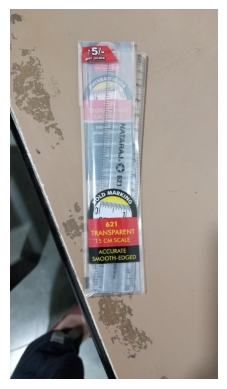</td>
<td>Non-Biodegradable</td>
<td>99.96%</td>
</tr>

</table>

---

### Key Observations
- Achieves near-perfect accuracy on organic waste items
- Strong classification performance on packaged materials
- Robust across real-world conditions and lighting variations

### Model Performance
- Training Accuracy: 94.28%
- Validation Accuracy: 93.56%

### Real-World Testing
The model was tested on diverse real-life waste scenarios including food items, plastic packaging, and mixed materials under varying lighting conditions.

The model demonstrates strong generalization across unseen real-world waste items.

## Deployment

The final model (`.keras` or `.tflite`) can be embedded into a Raspberry Pi, Jetson Nano, or ESP32-CAM-based system using OpenCV and GPIO controls to activate bins via servo motors or relays.

## 🎥 Project Demo

<p align="center">
  
</p>

## Evaluation and Metrics

- Validation Accuracy: ~94%
- Loss Function: Sparse Categorical Crossentropy
- Optimizer: Adam
- Evaluation: Performed on a separate unseen dataset with high confidence

Confusion matrix and accuracy reports are generated via `model_evaluation.py`.

## Author

Utkarsh Gupta  
Domain expertise: Machine Learning, Embedded Systems, Computer Vision

## License

This project is licensed under the MIT License. Feel free to use, modify, and distribute with attribution.
